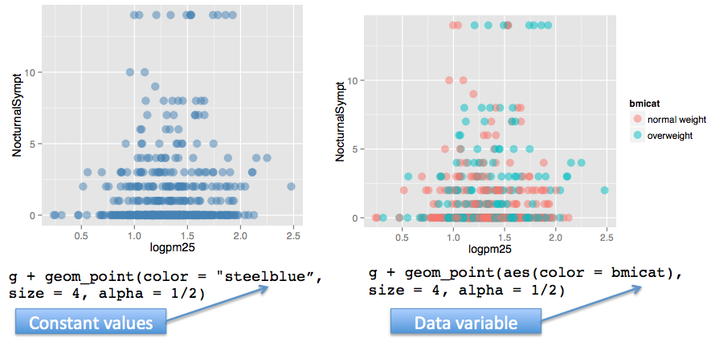
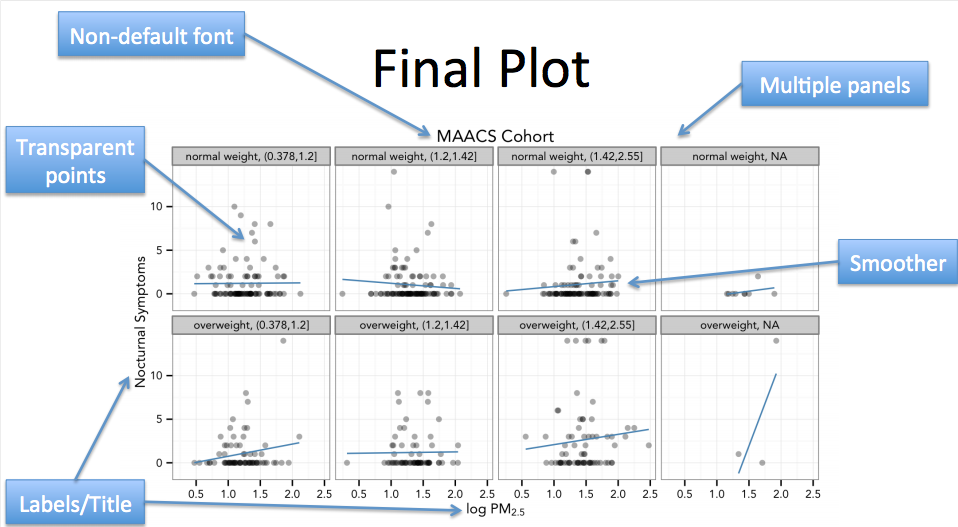

$\pagebreak$


## Principle of Analytic Graphics
* **Principle 1: Show Comparisons**
	* always comparative (compared to what)
	* randomized trial - compare control group to test group
	* evidence for a hypothesis is always relative to another competing hypothesis
* **Principle 2: Show causality/mechanism/explanation/systematic structure**
	* form hypothesis to evidence showing a relationship (causal framework, why something happened)
* **Principle 3: Show multivariate data**
	* more than 2 variables because the real world is multivariate
	* show as much data on a plot as you can
	* ***example***

```{r fig.height = 3, fig.width = 4, fig.align='center', echo=FALSE}
# install grid and png packages if not present
library(png)
library(grid)
grid.raster(readPNG("figures/1.jpg"))
```

* slightly negative relationship between pollution and mortality

```{r fig.height = 4, fig.width = 6, fig.align='center', echo=FALSE}
grid.raster(readPNG("figures/2.jpg"))
```
* when split up by season, the relationships are all positive $\rightarrow$ season = confounding variable

* **Principle 4: Integration of evidence**
	* use as many modes of evidence/displaying evidence as possible (modes of data presentation)
	* integrate words/numbers/images/diagrams (information rich)
	* analysis should drive the tool

* **Principle 5: Describe/document evidence with appropriate labels/scales/sources**
	* add credibility to that data graphic

* **Principle 6: Content is the most important**
	* analytical presentations ultimately stand/fall depending on quality/relevance/integrity of content


## Exploratory Graphs ([examples](http://gallery.r-enthusiasts.com/))
* **Purpose**: understand data properties, find pattern in data, suggest modeling strategies, debug
* **Characteristics**: made quickly, large number produced, gain personal understanding, appearances and presentation are aren’t as important

### One Dimension Summary of Data
* `summary(data)` = returns min, 1st quartile, median, mean, 3rd quartile, max
* `boxplot(data, col = “blue”)` = produces a box with middles 50% highlighted in the specified color
	* `whiskers` = $\pm 1.58IQR/\sqrt{n}$
		* IQR = interquartile range, Q$_3$ - Q$_1$
    * `box` = 25%, median, 75%
* `histograms(data, col = “green”)` = produces a histogram with specified breaks and color
	* `breaks = 100` = the higher the number is the smaller/narrower the histogram columns are
* `rug(data)` =  density plot, add a strip under the histogram indicating location of each data point
* `barplot(data, col = wheat)` = produces a bar graph, usually for categorical data

* **Overlaying Features**
* `abline(h/v = 12)` = overlays horizontal/vertical line at specified location
	* `col = “red”` = specifies color
	* `lwd = 4` = line width
	* `lty = 2` = line type

### Two Dimensional Summaries
* multiple/overlay 1D plots (using lattice/ggplot2)
* **box plots**: `boxplot(pm25 ~ region, data = pollution, col = “red”)`

```{r fig.height = 3, fig.width = 4, fig.align='center', echo=FALSE}
grid.raster(readPNG("figures/3.jpg"))
```

* **histogram**:
	* `par(mfrow = c(2, 1), mar = c(4, 4, 2, 1))` = set margin
	* `hist(subset(pollution, region == "east")$pm25, col = "green")` = first histogram
	* `hist(subset(pollution, region == "west")$pm25, col = "green")` = second histogram

```{r fig.height = 3, fig.width = 4, fig.align='center', echo=FALSE}
grid.raster(readPNG("figures/4.jpg"))
```

* **scatterplot**
	* `with(pollution, plot(latitude, pm25, col = region))`
	* `abline(h = 12, lwd = 2, lty = 2)` = plots horizontal dotted line
	* `plot(jitter(child, 4)~parent, galton)` = spreads out data points at the same position to simulate measurement error/make high frequency more visibble

```{r fig.height = 3, fig.width = 4, message = F, warning = F, fig.align='center', echo=FALSE}
grid.raster(readPNG("figures/5.jpg"))
```

```{r fig.height = 3, fig.width = 4, fig.align='center', message = F, warning = F, echo=FALSE}
library(UsingR); data(galton)
plot(jitter(child, 4)~parent, galton)
```


* **multiple scatter plots**
	* `par(mfrow = c(1, 2), mar = c(5, 4, 2, 1))` = sets margins
	* `with(subset(pollution, region == "west"), plot(latitude, pm25, main = "West"))` = left scatterplot
	* `with(subset(pollution, region == "east"), plot(latitude,  pm25, main = "East"))` = right scatterplot

```{r fig.height = 4, fig.width = 6, fig.align='center', echo=FALSE}
grid.raster(readPNG("figures/6.jpg"))
```

### Process of Making a Plot/Considerations
* where will plot be made? screen or file?
* how will plot be used? viewing on screen/web browser/print/presentation?
* large amount of data vs few points?
* need to be able to dynamically resize?
* **plotting system**: base, lattice, ggplot2?


## Base Plotting
* blank canvas, “artist’s palette”, start with plot function
* annotations - text, lines, points, axis
* convenient, but cannot go back when started (need to plan ahead)
* everything need to be manually set carefully to be able to achieve the desired effect (margins)
* core plotting/graphics engine in R encapsulated in the following
	* ***graphics***: plotting functions for vase graphing system (plot, hist, boxplot, tex.)
	* ***grDevices***: contains all the code implementing the various graphics devices (x11, PDF, PostScript, PNG, etc)

* ***Two phase***: initialize, annotate
* calling `plot(x, y)` or `hist(x)` will launch a graphics device and draw a plot on device
	* if no argument specified, default called
	* parameters documented in “`?par`"
	* ***Note**: it is some times necessary to convert column/variable to factor to make plotting easier *
		* `airquality <- transform(airquality, Month = factor(month))`

### Base Graphics Functions and Parameters
* **arguments**
	* `pch`: plotting symbol (default = open circle)
	* `lty`: line type (default is solid)
		* 0=blank, 1=solid (default), 2=dashed, 3=dotted, 4=dotdash, 5=longdash, 6=twodash
	* `lwd`: line width (integer)
	* `col`: plotting color (number string or hexcode, colors() returns vector of colors)
	* `xlab`, `ylab`: x-y label character strings
	* `cex`: numerical value giving the amount by which plotting text/symbols should be magnified relative to the default
		- `cex = 0.15 * variable`: plot size as an additional variable
* `par()` function = specifies global graphics parameters, affects all plots in an R session (can be overridden)
	* `las`: orientation of axis labels
	* `bg`: background color
	* `mar`: margin size (order = bottom left top right)
	* `oma`: outer margin size (default = 0 for all sides)
	* `mfrow`: number of plots per row, column (plots are filled row-wise)
	* `mfcol`: number of plots per row, column (plots are filled column-wise)
	* can verify all above parameters by calling `par("parameter")`
* **plotting functions**
	* `lines`: adds liens to a plot, given a vector of x values and corresponding vector of y values
	* `points`: adds a point to the plot
	* `text`: add text labels to a plot using specified x,y coordinates
	* `title`: add annotations to x,y axis labels, title, subtitles, outer margin
	* `mtext`: add arbitrary text to margins (inner or outer) of plot
	* `axis`: specify axis ticks

### Base Plot Example
```{r fig.height = 4, fig.width = 6, fig.align='center'}
library(datasets)
# type =“n” sets up the plot and does not fill it with data
with(airquality, plot(Wind, Ozone, main = "Ozone and Wind in New York City", type = "n"))
# subsets of data are plotted here using different colors
with(subset(airquality, Month == 5), points(Wind, Ozone, col = "blue"))
with(subset(airquality, Month != 5), points(Wind, Ozone, col = "red"))
legend("topright", pch = 1, col = c("blue", "red"), legend = c("May", "Other Months"))
model <- lm(Ozone ~ Wind, airquality)
# regression line is produced here
abline(model, lwd = 2)
```

### Multiple Plot Example
* ***Note**: typing `example(points)` in R will launch a demo of base plotting system and may provide some helpful tips on graphing *

```{r fig.height = 4, fig.width = 6, fig.align='center'}
# this expression sets up a plot with 1 row 3 columns, sets the margin and outer margins
par(mfrow = c(1, 3), mar = c(4, 4, 2, 1), oma = c(0, 0, 2, 0))
with(airquality, {
	# here three plots are filled in with their respective titles
	plot(Wind, Ozone, main = "Ozone and Wind")
	plot(Solar.R, Ozone, main = "Ozone and Solar Radiation")
	plot(Temp, Ozone, main = "Ozone and Temperature")
	# this adds a line of text in the outer margin*
	mtext("Ozone and Weather in New York City", outer = TRUE)}
)
```


$\pagebreak$

## Graphics Device
* A graphics device is something where you can make a plot appear
	* **window on screen** (screen device) = quick visualizations and exploratory analysis
	* **pdf** (file device) = plots that may be printed out or incorporated in to document
	* **PNG/JPEG** (file device) = plots that may be printed out or incorporated in to document
	* **scalable vector graphics** (SVG)
* When a plot is created in R, it has to be sent to a graphics device
* **Most common is screen device**
	* `quartz()` on Mac, `windows()` on Windows, `x11()` on Unix/Linux
	* `?Devices` = lists devices found
* **Plot creation**
	* screen device
		* call plot/xplot/qplot $\rightarrow$ plot appears on screen device $\rightarrow$ annotate as necessary $\rightarrow$ use
	* file devices
		* explicitly call graphics device $\rightarrow$ plotting function to make plot (write to file) $\rightarrow$ annotate as necessary $\rightarrow$ explicitly close graphics device with `dev.off()`
* **Graphics File Devices**
	* ***Vector Formats*** (good for line drawings/plots w/ solid colors, a modest number of points)
		* `pdf`: useful for line type graphics, resizes well, usually portable, not efficient if too many points
		* `svg`: XML based scalable vector graphics, support animation and interactivity, web based
		* `win.metafile`: Windows metafile format
		* `postscript`: older format, resizes well, usually portable, can create encapsulated postscript file, Windows often don’t have postscript viewer (postscript = predecessor of PDF)
	* ***Bitmap Formats*** (good for plots w/ large number of points, natural scenes/webbased plots)
		* `png`: Portable Network Graphics, good for line drawings/image with solid colors, uses lossless compression, most web browsers read this natively, good for plotting a lot of data points, does not resize well
		* `JPEG`: good for photographs/natural scenes/gradient colors, size efficient, uses lossy compression, good for plotting many points, does not resize well, can be read by almost any computer/browser, not great for line drawings (aliasing on edges)
		* `tiff`: common bitmap format supports lossless compression
		* `bmp`: native Windows bitmapped format
* **Multiple Open Graphics Devices**
	* possible to open multiple graphics devices (screen, file, or both)
	* plotting occurs only one device at a time
	* `dev.cur()` = returns the currently active device
	* every open graphics device is assigned an integer >= 2
	* `dev.set(<integer>)` = change the active graphics device
		`<integer>` = number associated with the graphics device you want to switch to
* **Copying plots**
	* `dev.copy()` = copy a plot from one device to another
	* `dev.copy2pdf()` = specifically for copying to PDF files
	* ***Note**: copying a plot is not an exact operation, so the result may not be identical to the original *
	* ***example***

```{r fig.height = 3, fig.width = 4, fig.align='center', results = 'hide'}
## Create plot on screen device
with(faithful, plot(eruptions, waiting))
## Add a main title
title(main = "Old Faithful Geyser data")
## Copy my plot to a PNG file
dev.copy(png, file = "geyserplot.png")
## Don't forget to close the PNG device!
dev.off()
```


$\pagebreak$

## `lattice` Plotting System
* `library(lattice)` = load lattice system
* implemented using the `lattice` and `grid` packages
	* `lattice` package = contains code for producing ***Trellis*** graphics (independent from base graphics system)
	* `grid` package = implements the graphing system; lattice build on top of grid
* all plotting and annotation is done with ***single function call***
	* margins/spacing/labels set automatically for entire plot, good for putting multiple on the screen
	* good for conditioning plots $\rightarrow$ examining same plots over different conditions how y changes vs x across different levels of z
	* `panel` functions can be specified/customized to modify the subplots
* lattice graphics functions return an object of class "trellis", where as base graphics functions plot data directly to graphics device
	* print methods for lattice functions actually plots the data on graphics device
	* trellis objects are auto-printed
	* `trellis.par.set()` $\rightarrow$ can be used to set global graphic parameters for all trellis objects
* hard to annotate, awkward to specify entire plot in one function call
* cannot add to plot once created, panel/subscript functions hard to prepare

### `lattice` Functions and Parameters
* **Funtions**
	* `xyplot()` = main function for creating scatterplots
	* `bwplot()` = box and whiskers plots (box plots)
	* `histogram()` = histograms
	* `stripplot()` = box plot with actual points
	* `dotplot()` = plot dots on "violin strings"
	* `splom()` = scatterplot matrix (like pairs() in base plotting system)
	* `levelplot()`/`contourplot()` = plotting image data
* **Arguments** for `xyplot(y ~ x | f * g, data, layout, panel)`
	* default blue open circles for data points
	* formula notation is used here (`~`) = left hand side is the y-axis variable, and the right hand side is the x-axis variable
	* `f`/`g` = conditioning/categorical variables (optional)
		* basically creates multi-panelled plots (for different factor levels)
		* `*` indicates interaction between two variables
		* intuitively, the xyplot displays a graph between x and y for every level of `f` and `g`
	* `data` = the data frame/list from which the variables should be looked up
		* if nothing is passed, the parent frame is used (searching for variables in the workspace)
		* if no other arguments are passed, defaults will be used
	* `layout` = specifies how the different plots will appear
		* `layout = c(5, 1)` = produces 5 subplots in a horizontal fashion
		* padding/spacing/margin automatically set
	* [optional] `panel` function can be added to control what is plotted inside each panel of the plot
		* `panel` functions receive x/y coordinates of the data points in their panel (along with any additional arguments)
		* `?panel.xyplot` = brings up documentation for the panel functions
		* ***Note**: no base plot functions can be used for lattice plots *


### `lattice` Example
```{r fig.height = 4, fig.width = 6, fig.align='center'}
library(lattice)
set.seed(10)
x <- rnorm(100)
f <- rep(0:1, each = 50)
y <- x + f - f * x+ rnorm(100, sd = 0.5)
f <- factor(f, labels = c("Group 1", "Group 2"))
## Plot with 2 panels with custom panel function
xyplot(y ~ x | f, panel = function(x, y, ...) {
	# call the default panel function for xyplot
	panel.xyplot(x, y, ...)
	# adds a horizontal line at the median
	panel.abline(h = median(y), lty = 2)
	# overlays a simple linear regression line
	panel.lmline(x, y, col = 2)
})
```


$\pagebreak$

## `ggplot2` Plotting System
* `library(ggplot2)` = loads ggplot2 package
* implementation of Grammar of Graphics by Leland Wilkinson, written by Hadley Wickham (created RStudio)

> "In brief, the grammar tells us that a statistical graphic is a mapping from data to aesthetic attributes (color, shape, size) of geometric objects (points, lines, bars). The plot may also contain statistical transformations of the data and is drawn on a specific coordinate system"

* grammar graphics plot, splits the different between base and lattice systems
* automatically sets spacings/text/tiles but also allows annotations to be added
* default makes a lot of choices, but still customizable

### `ggplot2` Functions and Parameters
* **basic components** of a `ggplot2` graphic
	* **data frame** = source of data
	* **aesthetic mappings** = how data are mappped to color/size (x vs y)
	* **geoms** = geometric objects like points/lines/shapes to put on page
	* **facets** = conditional plots using factor variables/multiple panels
	* **stats** = statistical transformations like binning/quantiles/smoothing
	* **scales** = scale aesthetic map uses (i.e. male = red, female = blue)
	* **coordinate system** = system in which data are plotted
* `qplot(x, y, data , color, geom)` = quick plot, analogous to base system’s `plot()` function
	* **default style**: gray background, white gridlines, x and y labels automatic, and solid black circles for data points
	* data always comes from data frame (in unspecified, function will look for data in workspace)
	* plots are made up of aesthetics (size, shape, color) and geoms (points, lines)
	* ***Note**: capable of producing quick graphics, but difficult to customize in detail*
* **factor variables**: important for graphing subsets of data = they should be labelled with specific information, and not just 1, 2, 3
	* `color = factor1` = use the factor variable to display subsets of data in different colors on the same plot (legend automatically generated)
	* `shape = factor2` = use the factor variable to display subsets of data in different shapes on the same plot (legend automatically generated)
	* ***example***

```{r fig.height = 3, fig.width = 4, fig.align='center', message = F, warning = F}
library(ggplot2)
qplot(displ, hwy, data = mpg, color = drv, shape = drv)
```

* **adding statistics**: `geom = c("points", "smooth")` = add a smoother/"low S"
	* "points" plots the data themselves, "smooth" plots a smooth mean line in blue with an area of 95% confidence interval shaded in dark gray
	* `method = "lm"` = additional argument method can be specified to create different lines/confidence intervals
		* `lm` = linear regression
	* ***example***

```{r fig.height = 3, fig.width = 4, fig.align='center'}
qplot(displ, hwy, data = mpg, geom = c("point", "smooth"), method="lm")
```

* **histograms**: if only one value is specified, a histogram is produced
	* `fill = factor1` = can be used to fill the histogram with different colors for the subsets (legend automatically generated)
	* ***example***

```{r fig.height = 3, fig.width = 4, fig.align='center', results='hide', message = F, warning = F}
qplot(hwy, data = mpg, fill = drv)
```

* **facets**: similar to panels in lattice, split data according to factor variables
	* `facets = rows ~ columns` = produce different subplots by factor variables specified (rows/columns)
	* `"."` indicates there are no addition row or column
	* `facets = . ~ columns` = creates 1 by col subplots
	* `facets = row ~ .` = creates row row by 1 subplots
	* labels get generated automatically based on factor variable values
	* ***example***

```{r fig.height = 3, fig.width = 4, fig.align='center', message = F, warning = F}
qplot(displ, hwy, data = mpg, facets = . ~ drv)
qplot(hwy, data = mpg, facets = drv ~ ., binwidth = 2)
```

* **density smooth**: smooths the histograms into a line tracing its shape
	* `geom = "density"` = replaces the default scatterplot with density smooth curve
	* ***example***

```{r fig.height = 4, fig.width = 8, fig.align='center', echo=FALSE}
grid.raster(readPNG("figures/16.jpg"))
```

* **`ggplot()`**
	* built up in layers/modularly (similar to base plotting system)
		* data $\rightarrow$ overlay summary $\rightarrow$ metadata/annotation
	* `g <- ggplot(data, aes(var1, var2))`
		* initiates call to `ggplot` and specifies the data frame that will be used
		* `aes(var1, var2)` = specifies aesthetic mapping, or var1 = x variable, and var2 = y variable
		* `summary(g)` = displays summary of ggplot object
		* `print(g)` = returns error ("no layer on plot") which means the plot does know how to draw the data yet
	* `g + geom_point()` = takes information from g object and produces scatter plot
	* `+ geom_smooth()` = adds low S mean curve with confidence interval
		* `method = "lm"` = changes the smooth curve to be linear regression
		* `size = 4`, `linetype = 3` = can be specified to change the size/style of the line
		* `se = FALSE` = turns off confidence interval

	* `+ facet_grid(row ~ col)` = splits data into subplots by factor variables (see facets from `qplot()`)
		* conditioning on continous variables is possible through cutting/making a new categorical variable
		* `cutPts <- quantiles(df$cVar, seq(0, 1, length=4), na.rm = TRUE)` = creates quantiles where the continuous variable will be cut
			* `seq(0, 1, length=4)` = creates 4 quantile points
			* `na.rm = TRUE` = removes all NA values
		* `df$newFactor <- cut(df$cVar, cutPts)` = creates new categorical/factor variable by using the cutpoints
			* creates n-1 ranges from n points = in this case 3

	* ***annotations***:
		* `xlab()`, `ylab()`, `labs()`, `ggtitle()` = for labels and titles
			* `labs(x = expression("log " * PM[2.5]), y = "Nocturnal")` = specifies x and y labels
			* `expression()` = used to produce mathematical expressions
		* `geom` functions = many options to modify
		* `theme()` = for global changes in presentation
			* ***example***: `theme(legend.position = "none")`
		* two standard themes defined: `theme_gray()` and `theme_bw()`
		* `base_family = "Times"` = changes font to Times

	* ***aesthetics***
		* `+ geom_point(color, size, alpha)` = specifies how the points are supposed to be plotted on the graph (style)
			* ***Note**: this translates to geom_line()/other forms of plots *
			* `color = "steelblue"` = specifies color of the data points
			* `aes(color = var1)` = wrapping color argument this way allows a factor variable to be assigned to the data points, thus subsetting it with different colors based on factor variable values
			* `size = 4` = specifies size of the data points
			* `alpha = 0.5` = specifies transparency of the data points
		* ***example***

	

	* ***axis limits***
		* `+ ylim(-3, 3)` = limits the range of y variable to a specific range
			* ***Note**: ggplot will exclude (not plot) points that fall outside of this range (outliers), potentially leaving gaps in plot *
		* `+ coord_cartesian(ylim(-3, 3))` = this will limit the visible range but plot all points of the data

### `ggplot2` Comprehensive Example

```r
# initiates ggplot
g <- ggplot(maacs, aes(logpm25, NocturnalSympt))
g + geom_point(alpha = 1/3) 					        # adds points
  + facet_wrap(bmicat ~ no2dec, nrow = 2, ncol = 4)     # make panels
  + geom_smooth(method="lm", se=FALSE, col="steelblue") # adds smoother
  + theme_bw(base_family = "Avenir", base_size = 10)    # change theme
  + labs(x = expression("log " * PM[2.5])   		    # add labels
  + labs(y = "Nocturnal Symptoms”)
  + labs(title = "MAACS Cohort”)
```




$\pagebreak$

## Hierarchical Clustering
* useful for visualizing high dimensional data, organizes things that are close into groups
* **agglomerative approach** (most common) — bottom up
	1. start with data
	2. find closest pairs, put them together (create "super point" and remove original data)
	3. find the next closest
	4. repeat = yields a tree showing order of merging (dendrogram)
	* requires
		* ***merging approach***: how to merge two points
		* ***distance metric***: calculating distance between two points
		* **continuous** - *Euclidean distance* $\rightarrow$ $\sqrt{(A_1 - A_2)^2 + (B_1 - B_2)^2 + \dots + (Z_1 -Z_2)^2 }$
		* **continuous** - *correlation similarity* $\rightarrow$ how correlated two data points are
		* **binary** - *manhattan distance* ("city block distance")$\rightarrow$ $|A_1 - A_2| + |B_1 - B_2| + \dots + |Z_1 -Z_2|$

```{r fig.height = 3, fig.width = 6, fig.align='center', echo=FALSE}
grid.raster(readPNG("figures/25.png"))
```

### Procedure for Constructing Hierarchical Clusters (`hclust` function)
1. calculate all pair wise distances between all points to see which points are closest together
	* `dist(data.frame(x=x, y=y)` --> returns pair wise distances for all of the (x,y) coordinates
	* ***Note**: `dist()` function uses Euclidean distance by default *
2. group two closest points from the calculated distances and merge them to a single point
3. find the next two closest points and merge them, and repeat
4. order of clustering is shown in the dendrogram

### Approaches for Merging Points/Clusters
* the approach is specified in the argument `method = "complete"` or `"average"` in `hclust()` function
* ***average linkage*** = taking average of the x and y coordinates for both points/clusters (center of mass effectively)
* ***complete linkage*** = to measure distance of two clusters, take the two points in the clusters that are the furthest apart
* ***Note**: two approaches may produce different results so it’s a good idea to use both approaches to validate results *

### Characteristics of Hierarchical Clustering Algorithms
* clustering result/plot maybe ***unstable***
	* changing few points/outliers could lead to large changes
	* change different distance metrics to see how sensitive the clustering is
	* change merging strategy
	* scaling of variables could affect the clustering (if one unit/measurement is much larger than another)
* ***deterministic*** = running the hclust function with same parameters and the same data will produce the same plot
* determining how many clusters there are (where to cut) may ***not always be clear***
* ***primarily used for exploratory data analysis***, to see over all pattern in data if there is any at all

### `hclust` Function and Example
* `hh <- hclust(dist(dataFrame))` function = produces a hierarchical cluster object based on pair wise distances from a data frame of x and y values
	* `dist()` = defaults to Euclidean, calculates the distance/similarity between two observations; when applied to a data frame, the function applies the $\sqrt{(A_1 - A_2)^2 + (B_1 - B_2)^2 + ... + (Z_1 -Z_2)^2 }$ formula to every pair of rows of data to construct a matrix of distances between the roes
		* order of the hierarchical cluster is derived from the distance
	* `plot(hh)` = plots the dendrogram
	* automatically sorts column and row according to cluster
	* `names(hh)` = returns all parameters of the hclust object
		* `hh$order` = returns the order of the rows/clusters from the dendrogram
		* `hh$dist.method` = returns method for calculating distance/similarity
* ***Note**: dendrogram that gets generated **DOES NOT** show how many clusters there are, so cutting (at 2.0 level for example) must be done to determine number of clusters — must be a convenient and sensible point *
* **`hclust` Example**

```{r fig.height = 3, fig.width = 4, fig.align='center'}
set.seed(1234)
x <- rnorm(12,mean=rep(1:3,each=4),sd=0.2)
y <- rnorm(12,mean=rep(c(1,2,1),each=4),sd=0.2)
dataFrame <- data.frame(x=x,y=y)
distxy <- dist(dataFrame)
hClustering <- hclust(distxy)
plot(hClustering)
```

### `myplcclust` Function and Example
* ***Note**: `myplcclust` = a function to plot hclust objects in color (clusters labelled 1 2 3 etc.), but must know how many clusters there are initially *

```{r fig.height = 3, fig.width = 4, fig.align='center'}
myplclust <- function(hclust, lab = hclust$labels,
	lab.col = rep(1, length(hclust$labels)), hang = 0.1, ...) {
	## modifiction of plclust for plotting hclust objects *in colour*! Copyright
	## Eva KF Chan 2009 Arguments: hclust: hclust object lab: a character vector
	## of labels of the leaves of the tree lab.col: colour for the labels;
	## NA=default device foreground colour hang: as in hclust & plclust Side
	## effect: A display of hierarchical cluster with coloured leaf labels.
	y <- rep(hclust$height, 2)
	x <- as.numeric(hclust$merge)
	y <- y[which(x < 0)]
	x <- x[which(x < 0)]
	x <- abs(x)
	y <- y[order(x)]
	x <- x[order(x)]
	plot(hclust, labels = FALSE, hang = hang, ...)
	text(x = x, y = y[hclust$order] - (max(hclust$height) * hang), labels = lab[hclust$order],
 col = lab.col[hclust$order], srt = 90, adj = c(1, 0.5), xpd = NA, ...)
}
# example
dataFrame <- data.frame(x = x, y = y)
distxy <- dist(dataFrame)
hClustering <- hclust(distxy)
myplclust(hClustering, lab = rep(1:3, each = 4), lab.col = rep(1:3, each = 4))
```

### `heatmap` Function and Example
* `heatmap(data.matrix)` function = similar to `image(t(x))`
	* good for visualizing high-dimension matrix data, runs hierarchical analysis on rows and columns of table
	* yellow = high value, red = low value
	* ***Note**: the input must be a numeric matrix, so as.matrix(data.frame) can be used to convert if necessary *
* ***example***

```{r fig.height = 3, fig.width = 4, fig.align='center'}
set.seed(12345)
data <- matrix(rnorm(400), nrow = 40)
heatmap(data)
```

### `image` Function and Example
* `image(x, y, t(dataMatrix)[, nrow(dataMatrix):1])` = produces similar color grid plot as the heatmap() without the dendrograms
	* `t(dataMatrix)[, nrow(dataMatrix)]`
		* `t(dataMatrix)` = transpose of dataMatrix, this is such that the plot will be displayed in the same fashion as the matrix (rows as values on the y axis and columns as values on the x axis)
			* ***example*** 40 x 10 matrix will have graph the 10 columns as x values and 40 rows as y values
		* `[, nrow(dataMatrix)]` = subsets the data frame in reverse column order; when combined with the `t()` function, it reorders the rows of data from 40 to 1, such that the data from the matrix is displayed in order from top to bottom
			* ***Note**: without this statemeant the rows will be displayed in order from bottom to top, as that is in line with the positive y axis *
	* `x`, `y` = used to specify the values displayed on the x and y axis
		* ***Note**: must be in increasing order *
* ***example***

```{r fig.height = 4, fig.width = 3, fig.align='center'}
image(1:10, 1:40, t(data)[, nrow(data):1])
```

$\pagebreak$

## K-means Clustering
* similar to hierarchical clustering, focuses on finding things that are close together
	* define close, groups, visualizing/interpreting grouping
* **partitioning approach**
	1. set number of clusters initially
	2. find centroids for each cluster
	3. assign points to the closest centroid
	4. recalculate centroid
	5. repeat = yields estimate of cluster centroids and which cluster each point belongs to
	* **requires**
		* distance metric
		* initial number of clusters
		* initial guess as to where the cluster centroids are

### Procedure for Constructing K-means Clusters (`kmeans` function)
1. choose three random points as the starting centroids
2. take each of the data points and assign it to the closest centroid (creating a cluster around each starting point)
3. take each cluster and recalculate the centroid (taking the mean) with its enclosed data points
4. repeat step 2 and 3 (reassign points to centroids and update centroid locations) until a stable result is achieved

* ***example***

```{r fig.height = 2, fig.width = 3, fig.align='center'}
set.seed(1234)
x <- rnorm(12,mean=rep(1:3,each=4),sd=0.2)
y <- rnorm(12,mean=rep(c(1,2,1),each=4),sd=0.2)
dataFrame <- data.frame(x=x,y=y)
# specifies initial number of clusters to be 3
kmeansObj <- kmeans(dataFrame,centers=3)
names(kmeansObj)
# returns cluster assignments
kmeansObj$cluster
par(mar=rep(0.2,4))
plot(x,y,col=kmeansObj$cluster,pch=19,cex=2)
points(kmeansObj$centers,col=1:3,pch=3,cex=3,lwd=3)
```

### Characteristics of K-means Clustering Algorithms
* requires number of clusters initially
	* pick by eye/intuition
	* pick by cross validation/information theory, etc. [link]
* not deterministic (starting points chosen at random)
	* useful to run the algorithms a few times with different starting points to validate results


$\pagebreak$

## Dimension Reduction
* two kinds of problems that relate to high-dimension dataset/matrix with many variables
	1. find a new set (smaller) of variables that are uncorrelated and explain as much variance of data as possible
		* normally many variables are not independent (i.e. height vs weight)
		* statistical problem, commonly solved with PCA
	2. find a lower rank matrix (best matrix created with fewer variables) that still explains the data
		* data compression problem, commonly solved SVD

* ***example***
	- ***Note**: we are arbitrarily introduced pattern in data: we flip a coin and if the it is heads, we replace the row with [0, 0, 0, 0, 0, 3, 3, 3, 3, 3] *
	- here we plot the patterns in rows and columns (already sorted)

```{r fig.height = 3, fig.width = 7, fig.align='center'}
for(i in 1:40){
  # flip a coin
  coinFlip <- rbinom(1,size=1,prob=0.5)
  # if coin is heads add a common pattern to that row
  if(coinFlip){
    data[i,] <- data[i,] + rep(c(0,3),each=5)
  }
}
# hierarchical clustering
hh <- hclust(dist(data))
dataOrdered <- data[hh$order,]
# create 1 x 3 panel plot
par(mfrow=c(1,3))
# heat map (sorted)
image(t(dataOrdered)[,nrow(dataOrdered):1])
# row means (40 rows)
plot(rowMeans(dataOrdered),40:1,,xlab="Row Mean",ylab="Row",pch=19)
# column means (10 columns)
plot(colMeans(dataOrdered),xlab="Column",ylab="Column Mean",pch=19)
```

### Singular Value Decomposition (SVD)
* Let $X$ = matrix which each variable in column (measurement) and each observation in row (subject)
* SVD in this case is a **matrix decomposition** process, in which X is divided into ***three*** separate matrices as follows: $$X = UDV^T$$
	- $U$ = left singular vector, orthogonal matrix (columns independent of each other)
	- $D$ = singular values, diagonal matrix
	- $V$ = right singular vector, orthogonal matrix (columns independent of each other)
	- ***Note**: orthogonal implies that a matrix is always invertible [$A^{-1} = A^T$] and that the product of the matrix and its transpose equals the identity matrix [$AA^T = I$] *
		+ when a orthogonal matrices, $A$, is multiplied by another matrix, $B$, it is effectively a linear transformation in that the length and angles of $B$ are preserved
	- ***Note**: diagonal implies that any value outside of the main diagonal ($\searrow$) = 0 *
		+ example $$A = \begin{bmatrix}
       1 & 0 & 0 \\
       0 & 2 & 0 \\
       0 & 0 & 3 \end{bmatrix}$$
* ***Note**: scale of data matters for SVD/PCA (scaling the data may help), patterns detected maybe mixed together, and computation is intensive for these operations *

### Principal Components Analysis (PCA)
* first scale the variables and run SVD on normalized matrix
	* **scaling** = subtract each column by its mean and divide by its standard deviation
* **principal components** = the right singular values or the $V$ matrix

### SVD and PCA Example
* **$U$ and $V$ Matrices**
	- `s <- svd(data)` = performs SVD on data ($n \times m$ matrix) and splits it into $u$, $v$, and $d$ matrices
		+ `s$u` = $n \times m$ matrix $\rightarrow$ horizontal variation
		+ `s$d` = $1 \times m$ vector $\rightarrow$ vector of the singular/diagonal values
			* `diag(s$d)` = $m \times m$ diagonal matrix
		+ `s$v` = $m \times m$ matrix $\rightarrow$ vertical variation
		+ `s$u %*% diag(s$d) %*% t(s$v)` returns the original data $\rightarrow$ $X = UDV^T$
	- `scale(data)` = scales the original data by subtracting each datapoint by its column mean and dividing by its column standard deviation

```{r fig.height=3,fig.width=7, fig.align = 'center'}
# running svd
svd1 <- svd(scale(dataOrdered))
# create 1 by 3 panel plot
par(mfrow=c(1,3))
# data heatmap (sorted)
image(t(dataOrdered)[,nrow(dataOrdered):1])
# U Matrix - first column
plot(svd1$u[,1],40:1,,xlab="Row",ylab="First left singular vector",pch=19)
# V vector - first column
plot(svd1$v[,1],xlab="Column",ylab="First right singular vector",pch=19)
```

* **$D$ Matrix and Variance Explained**
	* $d$ matrix (`s$d` vector) captures the singular values, or ***variation in data that is explained by that particular component*** (variable/column/dimension)
	* **proportion of variance Explained** = converting the singular values to variance (square the values) and divide by the total variance (sum of the squared singular values)
		- effectively the same pattern as the singular values, just converted to percentage
		- in this case, the first component/dimension, which captures the shift in means (see previous plot) of SVD captures about 40% of the variation

```{r fig.height=3,fig.width=5, fig.align = 'center'}
# create 1 x 2 panel plot
par(mfrow=c(1,2))
# plot singular values
plot(svd1$d,xlab="Column",ylab="Singular value",pch=19)
# plot proportion of variance explained
plot(svd1$d^2/sum(svd1$d^2),xlab="Column",ylab="Prop. of variance explained",pch=19)
```

* **Relationship to PCA**
	* `p <- prcomp(data, scale = TRUE)` = performs PCA on data specified
		- `scale = TRUE` = scales the data before performing PCA
		- returns `prcomp` object
		- `summary(p)` = prints out the principal component's standard deviation, proportion of variance, and cumulative proportion
	* PCA's rotation vectors are equivalent to their counterparits in the V matrix from the SVD

```{r fig.height=4,fig.width=4, fig.align='center'}
# SVD
svd1 <- svd(scale(dataOrdered))
# PCA
pca1 <- prcomp(dataOrdered,scale=TRUE)
# Plot the rotation from PCA (Principal Components) vs v vector from SVD
plot(pca1$rotation[,1],svd1$v[,1],pch=19,xlab="Principal Component 1",
	ylab="Right Singular Vector 1")
abline(c(0,1))
# summarize PCA
summary(pca1)
```

* **More Complex Patterns**
	* SVD can be used to ***detect unknown patterns*** within the data (we rarely know the true distribution/pattern about the population we're analyzing)
	* however, it may be hard to pinpoint exact patterns as the principal components may confound each other
		- in the example below, you can see that the two principal components that capture the most variation have both horizontal shifts and alternating patterns captured in them


```{r ,fig.height=6,fig.width=7, fig.align='center'}
set.seed(678910)
# setting pattern
data <- matrix(rnorm(400), nrow = 40)
for(i in 1:40){
  # flip a coin
  coinFlip1 <- rbinom(1,size=1,prob=0.5)
  coinFlip2 <- rbinom(1,size=1,prob=0.5)
  # if coin is heads add a common pattern to that row
  if(coinFlip1){
    data[i,] <- data[i,] + rep(c(0,5),each=5)
  }
  if(coinFlip2){
    data[i,] <- data[i,] + rep(c(0,5),5)
  }
}
hh <- hclust(dist(data)); dataOrdered <- data[hh$order,]

# perform SVD
svd2 <- svd(scale(dataOrdered))
par(mfrow=c(2,3))
image(t(dataOrdered)[,nrow(dataOrdered):1])
plot(rep(c(0,1),each=5),pch=19,xlab="Column", main="True Pattern 1")
plot(rep(c(0,1),5),pch=19,xlab="Column",main="True Pattern 2")
image(t(dataOrdered)[,nrow(dataOrdered):1])
plot(svd2$v[,1],pch=19,xlab="Column",ylab="First right singular vector",
	main="Detected Pattern 1")
plot(svd2$v[,2],pch=19,xlab="Column",ylab="Second right singular vector",
	main="Detected Pattern 2")
```

* **Missing Data**
	* SVD cannot be performed on dataset with `NA` values
	* `impute` package from [Bioconductor](http://bioconductor.org) can help approximate missing values from surrounding values
		- `impute.knn` function takes the missing row and imputes the data using the `k` nearest neighbors to that row
			+ `k=10` = default value (take the nearest 10 rows)

```{r fig.height=3,fig.width=5, fig.align='center'}
library(impute)  ## Available from http://bioconductor.org
data2 <- dataOrdered
# set random samples = NA
data2[sample(1:100,size=40,replace=FALSE)] <- NA
data2 <- impute.knn(data2)$data
svd1 <- svd(scale(dataOrdered)); svd2 <- svd(scale(data2))
par(mfrow=c(1,2))
plot(svd1$v[,1],pch=19, main="Original")
plot(svd2$v[,1],pch=19, main="Imputed")
```

### Create Approximations/Data Compression
* SVD can be used to create lower rank representation, or compressed representation of data
* if we look at the variance explained plot below, ***most of the variation*** is explained by the ***first few principal components***

```{r fig.height=3,fig.width=4, fig.align='center'}
# load faceData
load("figures/face.rda")
# perform SVD
svd3 <- svd(scale(faceData))
plot(svd3$d^2/sum(svd3$d^2),pch=19,xlab="Singular vector",ylab="Variance explained")
```

* approximations can thus be created by taking the first few components and using matrix multiplication with the corresponding $U$, $V$, and $D$ components

```{r fig.height=2.5,fig.width=7, fig.align='center'}
approx1 <- svd3$u[,1] %*% t(svd3$v[,1]) * svd3$d[1]
approx5 <- svd3$u[,1:5] %*% diag(svd3$d[1:5])%*% t(svd3$v[,1:5])
approx10 <- svd3$u[,1:10] %*% diag(svd3$d[1:10])%*% t(svd3$v[,1:10])
# create 1 x 4 panel plot
par(mfrow=c(1,4))
# plot original facedata
image(t(approx1)[,nrow(approx1):1], main = "1 Component")
image(t(approx5)[,nrow(approx5):1], main = "5 Component")
image(t(approx10)[,nrow(approx10):1], main = "10 Component")
image(t(faceData)[,nrow(faceData):1], main = "Original")
```


$\pagebreak$

## Color Packages in R Plots
* proper use of color can help convey the message by improving clarity/contrast of data presented
* default color schemes for most plots in R are fairly terrible, so some external packages are helpful

### `grDevices` Package
* `colors()` function = lists names of colors available in any plotting function
* **`colorRamp` function**
	- takes any set of colors and return a function that takes values between 0 and 1, indicating the extremes of the color palette (e.g. see the `gray` function)
	- `pal <- colorRamp(c("red", "blue"))` = defines a `colorRamp` function
	- `pal(0)` returns a 1 x 3 matrix containing values for RED, GREEN, and BLUE values that range from 0 to 255
	- `pal(seq(0, 1, len = 10))` returns a 10 x 3 matrix of 10 colors that range from RED to BLUE (two ends of spectrums defined in the object)
	- ***example***

```{r}
# define colorRamp function
pal <- colorRamp(c("red", "blue"))
# create a color
pal(0.67)
```

* **`colorRampPalette` function**
	- takes any set of colors and return a function that takes integer arguments and returns a vector of colors interpolating the palette (like `heat.colors` or `topo.colors`)
	- `pal <- colorRampPalette(c("red", "yellow"))` defines a `colorRampPalette` function
	- `pal(10)` returns 10 interpolated colors in hexidecimal format that range between the defined ends of spectrums
	- ***example***

```{r}
# define colorRampPalette function
pal <- colorRampPalette(c("red", "yellow"))
# create 10 colors
pal(10)
```

* **`rgb` function**
	- `red`, `green`, and `blue` arguments = values between 0 and 1
	- `alpha = 0.5` = transparency control, values between 0 and 1
	- returns hexidecimal string for color that can be used in `plot`/`image` commands
	- `colorspace` package cna be used for different control over colors
	- ***example***

```{r fig.height = 4, fig.width = 6, fig.align='center'}
x <- rnorm(200); y <- rnorm(200)
par(mfrow=c(1,2))
# normal scatter plot
plot(x, y, pch = 19, main = "Default")
# using transparency shows data much better
plot(x, y, col = rgb(0, 0, 0, 0.2), main = "With Transparency")
```

### `RColorBrewer` Package
* can be found on CRAN that has predefined color palettes
	* `library(RColorBrewer)`
* **types of palettes**
	- *Sequential* = numerical/continuous data that is ordered from low to high
	- *Diverging* = data that deviate from a value, increasing in two directions (i.e. standard deviations from the mean)
	- *Qualitative* = categorical data/factor variables
* palette information from the `RColorBrewer` package can be used by `colorRamp` and `colorRampPalette` functions
* **available colors palletes**

```{r fig.height = 6, fig.width = 8, fig.align='center', echo=FALSE}
grid.raster(readPNG("figures/color.png"))
```

* **`brewer.pal(n, "BuGn")` function**
	- `n` = number of colors to generated
	- `"BuGn"` = name of palette
		+ `?brewer.pal` list all available palettes to use
	- returns list of `n` hexidecimal colors
* ***example***

```{r fig.height = 3, fig.width = 7, fig.align='center'}
library(RColorBrewer)
# generate 3 colors using brewer.pal function
cols <- brewer.pal(3, "BuGn")
pal <- colorRampPalette(cols)
par(mfrow=c(1,3))
# heat.colors/default
image(volcano, main = "Heat.colors/Default")
# topographical colors
image(volcano, col = topo.colors(20), main = "Topographical Colors")
# RColorBrewer colors
image(volcano, col = pal(20), main = "RColorBrewer Colors")
```

* **`smoothScatter` function**
	- used to plot large quantities of data points
	- creates 2D histogram of points and plots the histogram
	- default color scheme = "Blues" palette from `RColorBrewer` package
	- ***example***

```{r fig.height = 4, fig.width = 4, fig.align='center'}
x <- rnorm(10000); y <- rnorm(10000)
smoothScatter(x, y)
```


$\pagebreak$

## Case Study: Human Activity Tracking with Smart Phones

**Loading Training Set of Samsung S2 Data from [UCI Repository](http://archive.ics.uci.edu/ml/datasets/Human+Activity+Recognition+Using+Smartphones)**


```{r}
# load data frame provided
load("samsungData.rda")
# table of 6 types of activities
table(samsungData$activity)
```

**Plotting Average Acceleration for First Subject**

```{r fig.height=4,fig.width=7, fig.align='center'}
# set up 1 x 2 panel plot
par(mfrow=c(1, 2), mar = c(5, 4, 1, 1))
# converts activity to a factor variable
samsungData <- transform(samsungData, activity = factor(activity))
# find only the subject 1 data
sub1 <- subset(samsungData, subject == 1)
# plot mean body acceleration in X direction
plot(sub1[, 1], col = sub1$activity, ylab = names(sub1)[1],
	main = "Mean Body Acceleration for X")
# plot mean body acceleration in Y direction
plot(sub1[, 2], col = sub1$activity, ylab = names(sub1)[2],
	main = "Mean Body Acceleration for Y")
# add legend
legend("bottomright",legend=unique(sub1$activity),col=unique(sub1$activity), pch = 1)
```


**Clustering Based on Only Average Acceleration**

```{r fig.height=5,fig.width=7, fig.align='center'}
# load myplclust function
source("myplclust.R")
# calculate distance matrix
distanceMatrix <- dist(sub1[,1:3])
# form hclust object
hclustering <- hclust(distanceMatrix)
# run myplclust on data
myplclust(hclustering, lab.col = unclass(sub1$activity))
```


**Plotting Max Acceleration for the First Subject**

```{r fig.height=4,fig.width=7, fig.align='center'}
# create 1 x 2 panel
par(mfrow=c(1,2))
# plot max accelecrations in x and y direction
plot(sub1[,10],pch=19,col=sub1$activity,ylab=names(sub1)[10],
	main = "Max Body Acceleration for X")
plot(sub1[,11],pch=19,col = sub1$activity,ylab=names(sub1)[11],
	main = "Max Body Acceleration for Y")
```


**Clustering Based on Maximum Acceleration**

```{r fig.height=5,fig.width=7, fig.align='center'}
# calculate distance matrix for max distances
distanceMatrix <- dist(sub1[,10:12])
hclustering <- hclust(distanceMatrix)
myplclust(hclustering,lab.col=unclass(sub1$activity))
```


**Singular Value Decomposition**

```{r fig.height=4,fig.width=7,fig.align='center', cache=TRUE}
# perform SVD minus last two columns (subject and activity)
svd1 = svd(scale(sub1[,-c(562,563)]))
# create 1 x 2 panel plot
par(mfrow=c(1,2))
# plot first two left singular vector
# separate moving from non moving
plot(svd1$u[,1],col=sub1$activity,pch=19, main = "First Left Singular Vector")
plot(svd1$u[,2],col=sub1$activity,pch=19, main = "Second Left Singular Vector")
```


**New Clustering with Maximum Contributers**

```{r fig.height=5,fig.width=7,fig.align='center'}
# find the max contributing feature
maxContrib <- which.max(svd1$v[,2])
# recalculate distance matrix
distanceMatrix <- dist(sub1[, c(10:12,maxContrib)])
hclustering <- hclust(distanceMatrix)
myplclust(hclustering,lab.col=unclass(sub1$activity))
# name of max contributing factor
names(samsungData)[maxContrib]
```


**K-means Clustering (nstart=1, first try)**

```{r}
# specify 6 centers for data
kClust <- kmeans(sub1[,-c(562,563)],centers=6)
# tabulate 6 clusteres against 6 activity but many clusters contain multiple activities
table(kClust$cluster,sub1$activity)
```

**K-means clustering (nstart=100, first try)**

```{r cache=TRUE}
# run k-means algorithm 100 times
kClust <- kmeans(sub1[,-c(562,563)],centers=6,nstart=100)
# tabulate results
table(kClust$cluster,sub1$activity)
```

**K-means clustering (nstart=100, second try)**

```{r cache=TRUE}
# run k-means algorithm 100 times
kClust <- kmeans(sub1[,-c(562,563)],centers=6,nstart=100)
# tabulate results
table(kClust$cluster,sub1$activity)
```

**Cluster 1 Variable Centers (Laying)**

```{r fig.height=4,fig.width=5, fig.align='center'}
# plot first 10 centers of k-means for laying to understand which features drive the activity
plot(kClust$center[1,1:10],pch=19,ylab="Cluster Center",xlab="")
```


**Cluster 2 Variable Centers (Walking)**

```{r fig.height=4,fig.width=5, fig.align='center'}
# plot first 10 centers of k-means for laying to understand which features drive the activity
plot(kClust$center[4,1:10],pch=19,ylab="Cluster Center",xlab="")
```


$\pagebreak$

## Case Study: Fine Particle Pollution in the U.S. from 1999 to 2012

**Read Raw Data from 1999 and 2012**

```{r cache = TRUE}
# read in raw data from 1999
pm0 <- read.table("pm25_data/RD_501_88101_1999-0.txt", comment.char = "#", header = FALSE, sep = "|", na.strings = "")
# read in headers/column lables
cnames <- readLines("pm25_data/RD_501_88101_1999-0.txt", 1)
# convert string into vector
cnames <- strsplit(substring(cnames, 3), "|", fixed = TRUE)
# make vector the column names
names(pm0) <- make.names(cnames[[1]])
# we are interested in the pm2.5 readings in the "Sample.Value" column
x0 <- pm0$Sample.Value
# read in the data from 2012
pm1 <- read.table("pm25_data/RD_501_88101_2012-0.txt", comment.char = "#", header = FALSE, sep = "|",
	na.strings = "", nrow = 1304290)
# make vector the column names
names(pm1) <- make.names(cnames[[1]])
# take the 2012 data for pm2.5 readings
x1 <- pm1$Sample.Value
```

**Summaries for Both Periods**

```{r}
# generate 6 number summaries
summary(x1)
summary(x0)
# calculate % of missing values, Are missing values important here?
data.frame(NA.1990 = mean(is.na(x0)), NA.2012 = mean(is.na(x1)))
```

**Make a boxplot of both 1999 and 2012**

```{r warning=FALSE, fig.width = 7, fig.height = 4, fig.align = 'center'}
par(mfrow = c(1,2))
# regular boxplot, data too right skewed
boxplot(x0, x1, main = "Regular Boxplot")
# log boxplot, significant difference in means, but more spread
boxplot(log10(x0), log10(x1), main = "log Boxplot")
```

**Check for Negative Values in 'x1'**

```{r fig.width = 5, fig.height = 4, fig.align = 'center'}
# summary again
summary(x1)
# create logical vector for
negative <- x1 < 0
# count number of negatives
sum(negative, na.rm = T)
# calculate percentage of negatives
mean(negative, na.rm = T)
# capture the date data
dates <- pm1$Date
dates <- as.Date(as.character(dates), "%Y%m%d")
# plot the histogram
hist(dates, "month")  ## Check what's going on in months 1--6
```

**Check Same New York Monitors at 1999 and 2012**

```{r}
# find unique monitors in New York in 1999
site0 <- unique(subset(pm0, State.Code == 36, c(County.Code, Site.ID)))
# find unique monitors in New York in 2012
site1 <- unique(subset(pm1, State.Code == 36, c(County.Code, Site.ID)))
# combine country codes and siteIDs of the monitors
site0 <- paste(site0[,1], site0[,2], sep = ".")
site1 <- paste(site1[,1], site1[,2], sep = ".")
# find common monitors in both
both <- intersect(site0, site1)
# print common monitors in 1999 and 2012
print(both)
```

**Find how many observations available at each monitor**

```{r}
# add columns for combined county/site for the original data
pm0$county.site <- with(pm0, paste(County.Code, Site.ID, sep = "."))
pm1$county.site <- with(pm1, paste(County.Code, Site.ID, sep = "."))
# find subsets where state = NY and county/site = what we found previously
cnt0 <- subset(pm0, State.Code == 36 & county.site %in% both)
cnt1 <- subset(pm1, State.Code == 36 & county.site %in% both)
# split data by the county/size values and count oberservations
sapply(split(cnt0, cnt0$county.site), nrow)
sapply(split(cnt1, cnt1$county.site), nrow)
```

**Choose Monitor where County = 63 and Side ID = 2008**

```{r}
# filter data by state/county/siteID
pm1sub <- subset(pm1, State.Code == 36 & County.Code == 63 & Site.ID == 2008)
pm0sub <- subset(pm0, State.Code == 36 & County.Code == 63 & Site.ID == 2008)
# there are 30 observations from 2012, and 122 from 1999
dim(pm1sub)
dim(pm0sub)
```

**Plot Data for 2012**

```{r fig.width=4, fig.height=4, fig.align = 'center'}
# capture the dates of the subset of data
dates1 <- pm1sub$Date
# capture measurements for the subset of data
x1sub <- pm1sub$Sample.Value
# convert dates to appropriate format
dates1 <- as.Date(as.character(dates1), "%Y%m%d")
# plot pm2.5 value vs time
plot(dates1, x1sub, main = "PM2.5 Polution Level in 2012")
```

**Plot data for 1999**

```{r fig.width=4, fig.height=4, fig.align = 'center'}
# capture the dates of the subset of data
dates0 <- pm0sub$Date
# convert dates to appropriate format
dates0 <- as.Date(as.character(dates0), "%Y%m%d")
# capture measurements for the subset of data
x0sub <- pm0sub$Sample.Value
# plot pm2.5 value vs time
plot(dates0, x0sub, main = "PM2.5 Polution Level in 1999")
```

**Panel Plot for Both Years**

```{r fig.width=6, fig.height=4, fig.align = 'center'}
# find max range for data
rng <- range(x0sub, x1sub, na.rm = T)
# create 1 x 2 panel plot
par(mfrow = c(1, 2), mar = c(4, 4, 2, 1))
# plot time series plot for 1999
plot(dates0, x0sub, pch = 20, ylim = rng, main="Pollution in 1999")
# plot the median
abline(h = median(x0sub, na.rm = T))
# plot time series plot for 2012
plot(dates1, x1sub, pch = 20, ylim = rng, main="Pollution in 2012")
# plot the median
abline(h = median(x1sub, na.rm = T))
```

**Find State-wide Means and Trend**

```{r fig.width=5, fig.height=5, fig.align = 'center'}
# divide data by state and find tne mean of pollution level for 1999
mn0 <- with(pm0, tapply(Sample.Value, State.Code, mean, na.rm = T))
# divide data by state and find tne mean of pollution level for 1999
mn1 <- with(pm1, tapply(Sample.Value, State.Code, mean, na.rm = T))
# convert to data frames while preserving state names
d0 <- data.frame(state = names(mn0), mean = mn0)
d1 <- data.frame(state = names(mn1), mean = mn1)
# merge the 1999 and 2012 means by state
mrg <- merge(d0, d1, by = "state")
# dimension of combined data frame
dim(mrg)
# first few lines of data
head(mrg)

# plot the pollution levels data points for 1999
with(mrg, plot(rep(1, 52), mrg[, 2], xlim = c(.8, 2.2), ylim = c(3, 20),
	main = "PM2.5 Pollution Level by State for 1999 & 2012",
	xlab = "", ylab = "State-wide Mean PM"))
# plot the pollution levels data points for 2012
with(mrg, points(rep(2, 52), mrg[, 3]))
# connected the dots
segments(rep(1, 52), mrg[, 2], rep(2, 52), mrg[, 3])
# add 1999 and 2012 labels
axis(1, c(1, 2), c("1999", "2012"))
```

